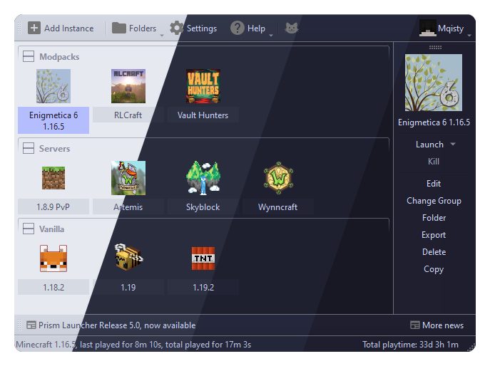
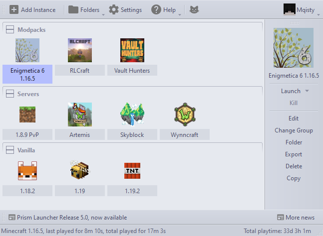
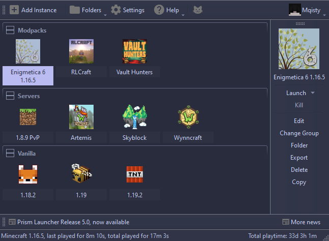
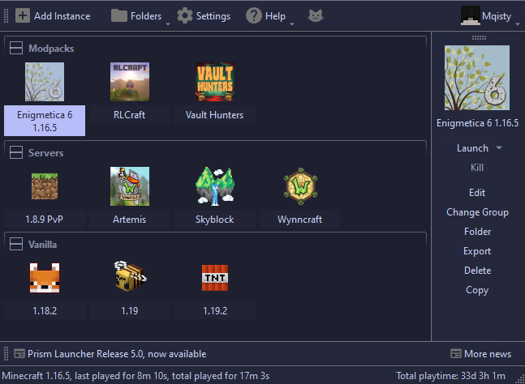
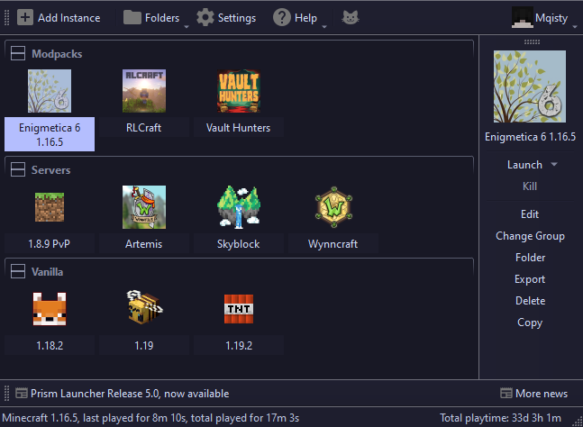

<h3 align="center">
	 
	
	Catppuccin for <a href="https://prismlauncher.org/">Prism Launcher</a>
	
</h3>

	
	
	

	

## Previews

🌻 Latte

🪴 Frappé

🌺 Macchiato

🌿 Mocha

## Installation

1. Download your preferred style:

- 🌻 [Latte](./themes/Latte)
- 🪴 [Frappe](./themes/Frappe)
- 🌺 [Macchiato](./themes/Macchiato)
- 🌿 [Mocha](./themes/Mocha)

2. Open your local Prism Launcher Directory:
- Windows: `%appdata%\PrismLauncher\themes\custom`
- Linux: `~/.local/share/PrismLauncher/themes/custom`
- Mac: `~/Library/Application Support/PrismLauncher/themes/custom`
- Flatpak: `~/.var/app/org.prismlauncher.PrismLauncher/data/PrismLauncher/themes/custom`

3. Replace `theme.json` and `themeStyle.css` with the Catppuccin theme of your choice.

4. Restart Prism Launcher, then open global settings. In the `Launcher` section, click the `User Interface` tab and under the `Colors` dropdown select the Catppuccin theme you downloaded. Press the `Close` button and the theme will be applied.

## 💝 Thanks to

- [moisty](https://github.com/Mqisty)

&nbsp;

	

	Copyright &copy; 2021-present <a href="https://github.com/catppuccin" target="_blank">Catppuccin Org</a>

	

